| Nama | Nova Tegar Adiyansyah |
| ------ | ---------------- |
|Nim | 312010145   |
| Kelas | TI.20.A1 |

# Langkah-langkah Praktikum 6  

 # 1. Buat folder baru dengan nama lab6_css_framework, Buat file baru dokumen html 

 

 # 2. Buatlah layout web sederhana menggunakan css frameword (Twitter Bootsrtap) 

## 1. Quick start 

  Buka web https://getbootstrap.com/docs/5.1/getting-started/introduction/ lalu copy. 

  

## 2. Navbar 

  Buat komponen website yang berupa menu 
  Untuk mencari component klik menu documentation pada web bootstrap 

  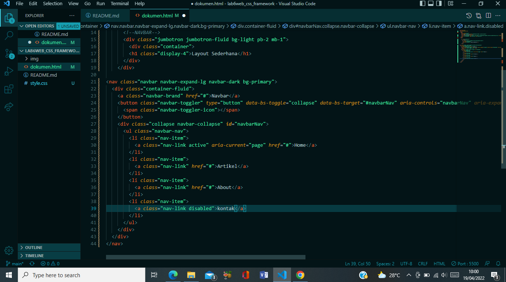

  kemudian refresh browsur  

  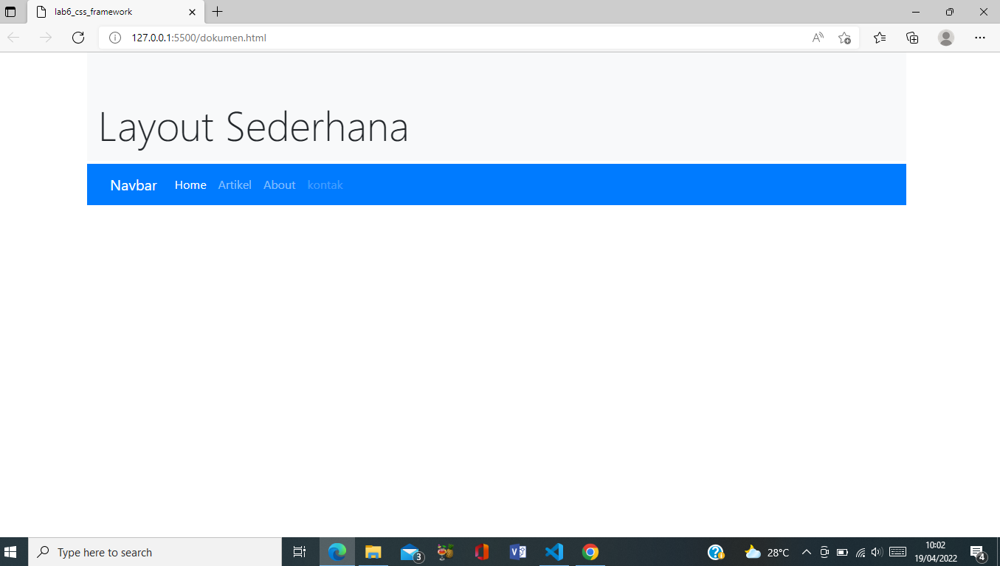

## 3. Jumbroton

  Selanjutnya buat jumbotron  

  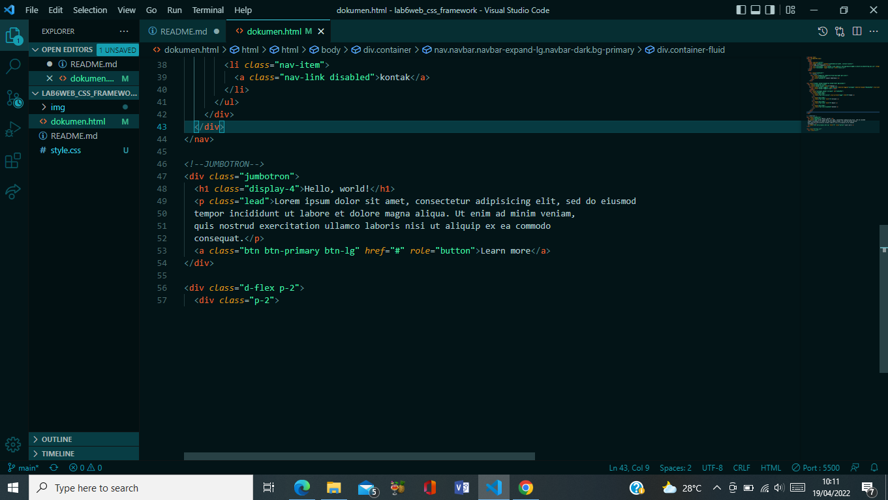 

  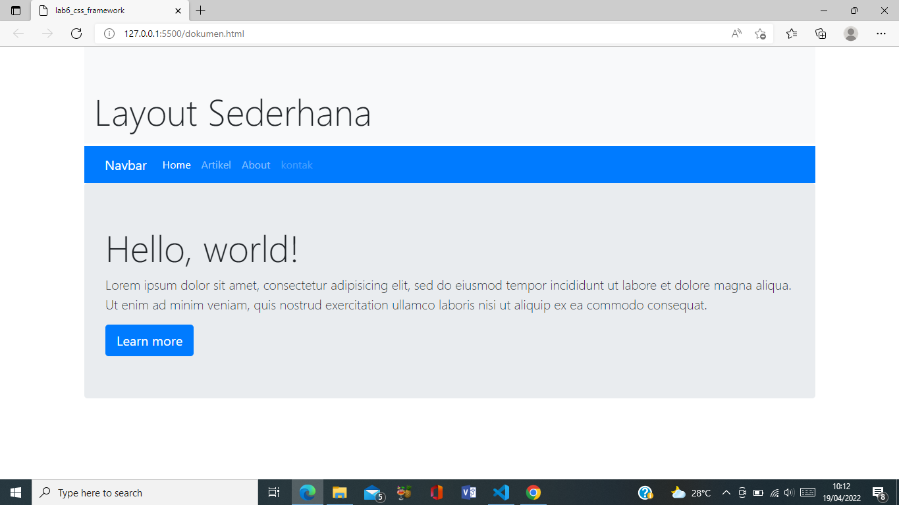

## 4. Cards

Untuk membuat body konten, saya menggunakan cards. 

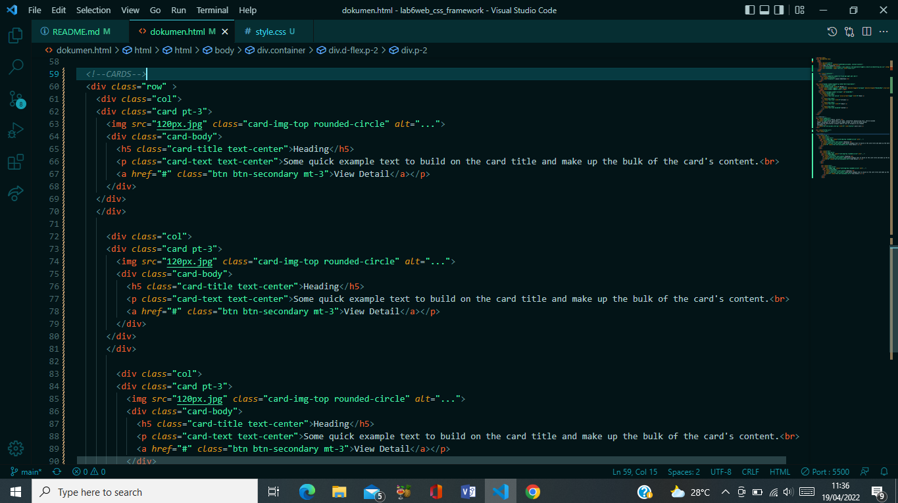

Menambah style untuk mengatur ukuran dan posisi pada gambar 

Refresh browsure

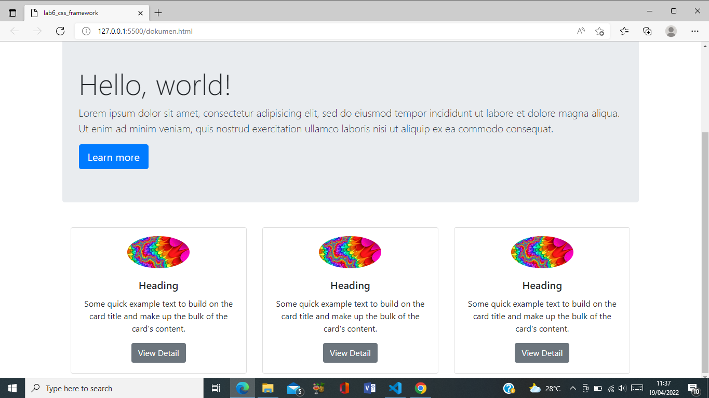

## 5. List Group 

Tambahkan widget disamping kanan cards 

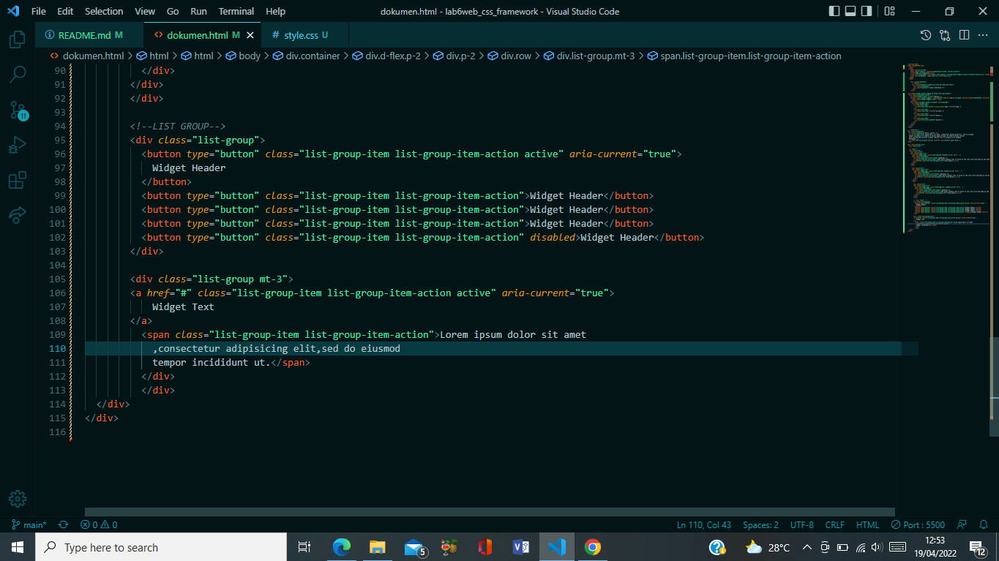

Hasilnya  
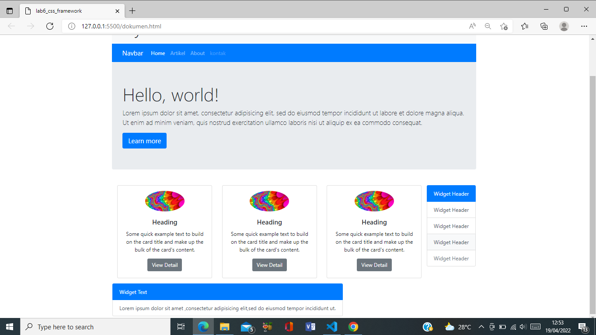

## 6. Cards 2

Buat body konten yang kedua 

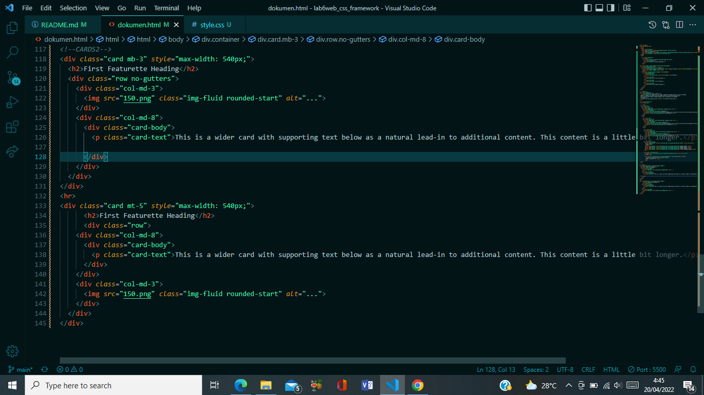

Hasilnya  
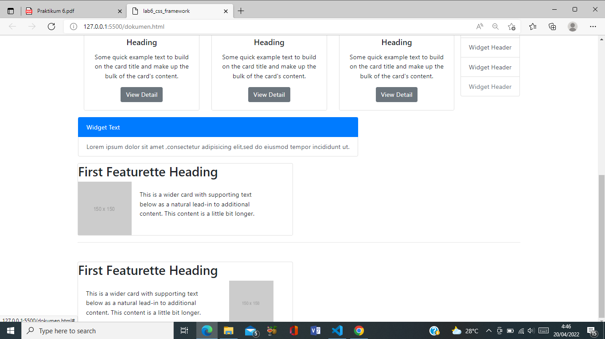

## 7. Footer 

Tambahkan footer 

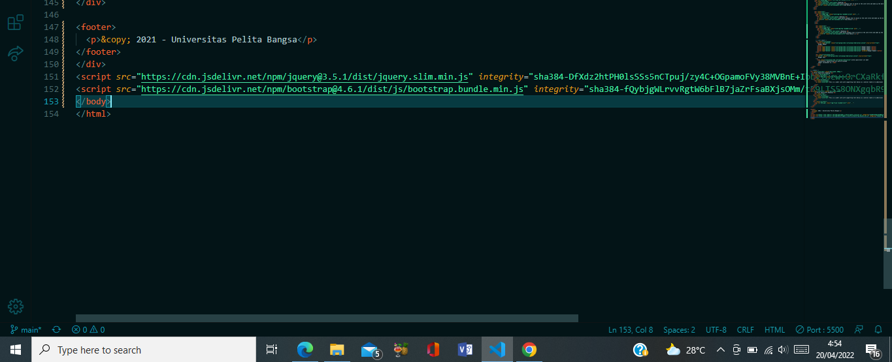

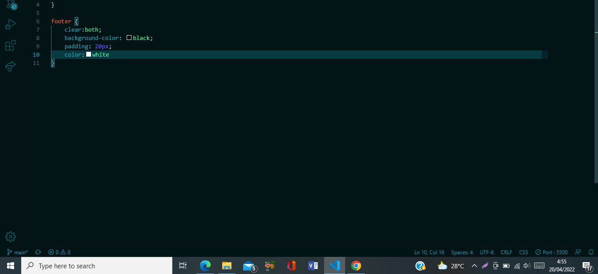

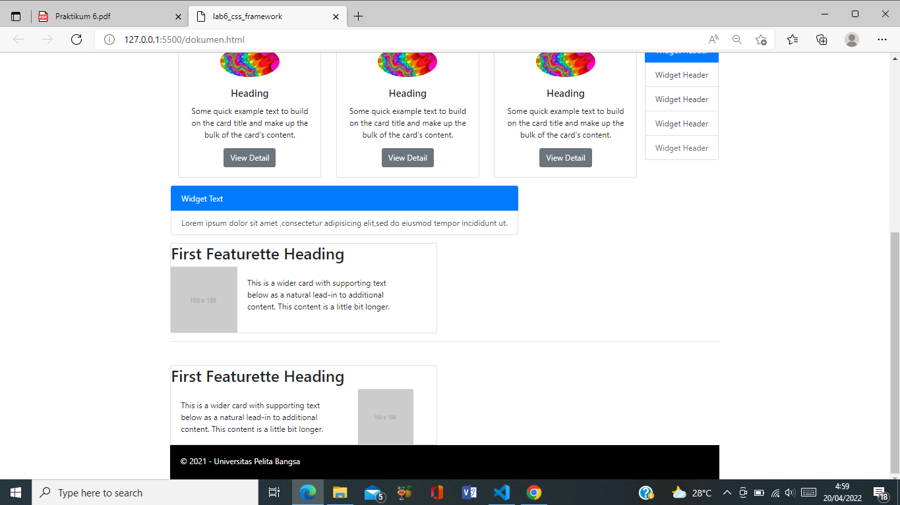

 

## Tampilan Full

