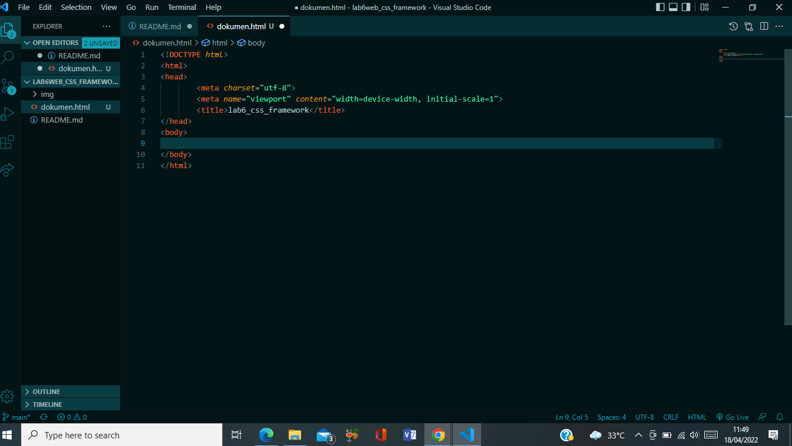
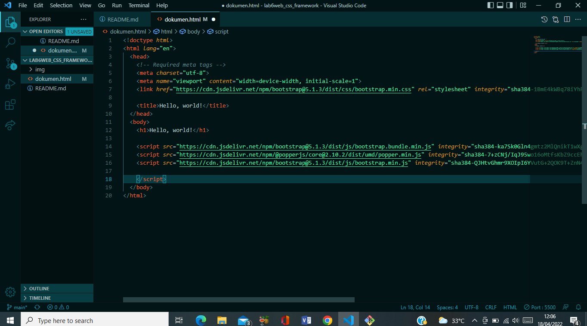

| Nama | Nova Tegar Adiyansyah |
| ------ | ---------------- |
|Nim | 312010145   |
| Kelas | TI.20.A1 |

# Langkah-langkah Praktikum 6  

 # 1. Buat folder baru dengan nama lab6_css_framework, Buat file baru dokumen html 

 

 # 2. Buatlah layout web sederhana menggunakan css frameword (Twitter Bootsrtap) 

 ## 1. Quick start 

  Buka web https://getbootstrap.com/docs/5.1/getting-started/introduction/ lalu copy. 

  

